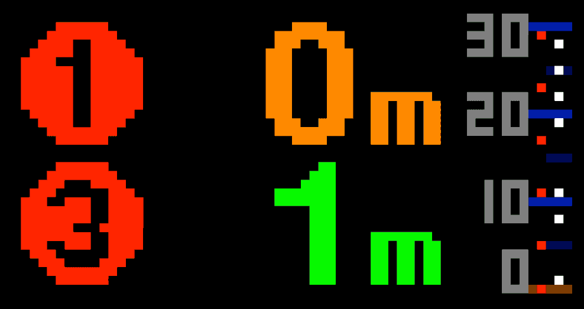

# NYC subway train departures board

Display upcoming departures of New York City subway trains from a specific station on an LED matrix, powered by the MTA realtime data feeds.


## Hardware

### Components used

- [Raspberry Pi Zero W](https://www.raspberrypi.com/products/raspberry-pi-zero-w/)
- [64x32 LED matrix, 5mm pitch](https://smile.amazon.com/gp/product/B07SDMWX9R/) – can get cheaper from Aliexpress, but longer shipping time
- [Adafruit RGB Matrix Bonnet](https://www.adafruit.com/product/3211)
- [Power supply, 5V 8A](https://smile.amazon.com/dp/B078RZBL8X/)
- [Mounting tape](https://smile.amazon.com/gp/product/B00347A8GC/) – (optional) attach Pi to matrix
- [Cable concealer](https://smile.amazon.com/gp/product/B07D8WVJWF/) – (optional) for power supply cord

### Build process

The hardware build is pretty straightforward and mostly involves plugging things in to the right places, unless you want to add an on/off button to the matrix. For Pis without a header, you will need to solder one on. Consider a Raspberry Pi Zero W (or the Zero 2 W) for a smaller form factor. The software commands will take a while to start up vs. newer/faster models, but once they get going I haven't faced any issues.

I followed [this tutorial](https://howchoo.com/pi/raspberry-pi-led-matrix-panel) and watched the associated [YouTube video](https://www.youtube.com/watch?v=EPZawKPC73k) for most of the guidance I needed. (The video displays something different in software, but the hardware setup is the same.)

I did make the mod described in the [Adafruit RGB Matrix Bonnet documentation](http://https://cdn-learn.adafruit.com/downloads/pdf/adafruit-rgb-matrix-bonnet-for-raspberry-pi.pdf) under Step 6 to eliminate matrix flicker: soldering a short wire to the bonnet between pins GPIO4 and GPIO18. After making this hardware mod, you need to disable sound on the Pi by following [these steps](https://github.com/hzeller/rpi-rgb-led-matrix#bad-interaction-with-sound). I didn't bother digging into why this was only an issue with the hardware mod; it doesn't really matter because this project does not involve audio.

## Installation

Tested running:

- macOS on Apple Silicon (with web-based viewer for development)
- Raspberry Pi Zero W on ARMv6 (with LED matrix connection)

1. `npm install`
2. (on Pi only) `./scripts/build_rpi-rgb-led-matrix.sh`

## Running

### Generate board image

1. Create an account at https://api.mta.info/#/signup
2. Get an API key from https://api.mta.info/#/AccessKey (link only goes to the right page once logged in)

```shell
API_KEY=<Your API key> npm start
```
### Display board on LED matrix (Pi only)

```shell
npm run display
```

### Web-based board viewer (for development)

```shell
npm run web-viewer
```

View the board at http://localhost:8000/viewer.html

## Explanation of board layout

(Images like this can be displayed with the web-based board viewer mentioned above):




**\*Timeline view:** Trains are shown approaching the station (at bottom, orange line).

- Left column (red dots): local trains
- Right column (white dots): express trains

The vertical position of train dots is based on their number of minutes from the station, as shown by the tick marks and the "30", "20", "10, "0" labels. Each row of pixels represents one minute.

---

You'll need to create your own train circle "sprite" images for your station's lines (unless they happen to be the 123 🙂), as well as update some references in code specific to 123 trains.
 
The board only shows trains going in one direction because most of the time I only go downtown from my stop. Not needing to display the train direction freed up some space on the matrix for the timeline view in my implementation.

There's an earlier branch of this code, [`no-timeline`](https://github.com/liddiard/nyc-subway-board/tree/no-timeline), which displays both directions along with an arrow direction indicator but doesn't have a timeline view. The code is older and I'm not using it, so it's less finished/polished.

## Project structure

[`index.js`](index.js): Main entry point for Node.js app that calls MTA API for train departures, generates a board image using the JavaScript `canvas` API, and writes it to disk. It runs in a loop, cycling the board image through upcoming departures shown in large text. It requests updated departure information at the end of each cycle.

### [`src/`](src/)

- [departures.js](src/departures.js): Fetches upcoming departure information from the MTA API and transforms the response to desired format
- [board.js](src/board.js): HTML `canvas` board drawing happens here
- [image.js](src/image.js): Utilities for caching the smaller "sprite" images that are combined to form the overall board `canvas` image
- [constants.js](src/constants.js): Constants. `STATION_ID` is the subway station from which the departures are shown.

`board.png`: Not in version control, image of the board to display. Generated the by Node.js app. View it on the web viewer or the LED matrix as detailed above under [Running](#Running).

[`image-viewer.py`](image-viewer.py): Script that recurringly reads the board image file from disk and displays it on the LED matrix using the [Python bindings](https://github.com/hzeller/rpi-rgb-led-matrix/tree/master/bindings/python) of [rpi-rgb-led-matrix](https://github.com/hzeller/rpi-rgb-led-matrix). Used Python rather than the faster C++ library because it was more developer friendly (to me) and because the display refresh rate doesn't need to be particularly fast since it only shows a new frame every 5 seconds.

[`graphics/`](graphics/): Sprite images used on the board, positioned and composited by the Node.js app

[`scripts/`](scripts/) One-time bash scripts used for dependency installation:

- `install_canvas_dependencies.sh` automatically runs before `npm install` to install the required `canvas` package dependencies. `npm install` will fail without doing this first. 
- `build_rpi-rgb-led-matrix.sh` builds the binaries for `rpi-rgb-led-matrix` on Linux OSs with `apt-get` only. This library displays the board image file on the LED matrix.

