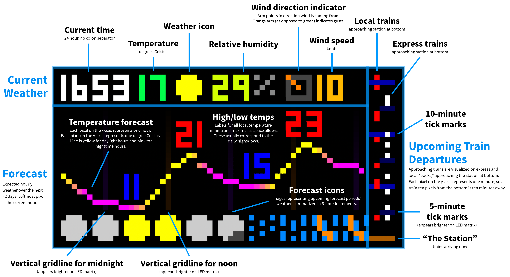

# Current weather, forecast, and NYC subway train visualization board

Display information you may want to know when leaving the house on a fancy fridge magnet, a.k.a. an LED matrix. Powered by [weather.gov](https://www.weather.gov/documentation/services-web-api) and [MTA realtime data](https://api.mta.info/#/landing) APIs.


Wondering what everything on this display means? [Jump down to the explanation](#explanation-of-board-layout)!

## Hardware

### Components used

- [Raspberry Pi Zero W](https://www.raspberrypi.com/products/raspberry-pi-zero-w/)
- [64x32 LED matrix, 5mm pitch](https://smile.amazon.com/gp/product/B07SDMWX9R/) – can get cheaper from Aliexpress, but longer shipping time
- [Adafruit RGB Matrix Bonnet](https://www.adafruit.com/product/3211)
- [Power supply, 5V 8A](https://smile.amazon.com/dp/B078RZBL8X/)
- [Mounting tape](https://smile.amazon.com/gp/product/B00347A8GC/) – (optional) attach Pi to matrix
- [Cable concealer](https://smile.amazon.com/gp/product/B07D8WVJWF/) – (optional) for power supply cord

### Build process

The hardware build is pretty straightforward and mostly involves plugging things in to the right places, unless you want to add an on/off button to the matrix. For Pis without a header, you will need to solder one on. Consider a Raspberry Pi Zero W (or the Zero 2 W) for a smaller form factor. The software commands will take a while to start up vs. newer/faster models, but once they get going I haven't faced any issues.

I followed [this tutorial](https://howchoo.com/pi/raspberry-pi-led-matrix-panel) and watched the associated [YouTube video](https://www.youtube.com/watch?v=EPZawKPC73k) for most of the guidance I needed. (The video displays something different in software, but the hardware setup is the same.)

I did make the mod described in the [Adafruit RGB Matrix Bonnet documentation](http://https://cdn-learn.adafruit.com/downloads/pdf/adafruit-rgb-matrix-bonnet-for-raspberry-pi.pdf) under Step 6 to eliminate matrix flicker: soldering a short wire to the bonnet between pins GPIO4 and GPIO18. After making this hardware mod, you need to disable sound on the Pi by following [these steps](https://github.com/hzeller/rpi-rgb-led-matrix#bad-interaction-with-sound). I didn't bother digging into why this was only an issue with the hardware mod; it doesn't really matter because this project does not involve audio.

## Software installation

Tested running:

- macOS on Apple Silicon (with web-based viewer for development)
- Raspberry Pi OS Lite on ARMv6, running on a Raspberry Pi Zero W (with LED matrix connection)

1. `npm install`
2. (on Pi only) `./scripts/build_rpi-rgb-led-matrix.sh`
3. Get a free personal API key from Pirate Weather: https://pirateweather.net/

Note: Package `node-canvas` is kept at version 2.x because version 3.x fails to build on ARMv6.

## Running

### Generate board image

```shell
PIRATE_API_KEY=your_api_key npm start
```

You can also `npm run dev` with your API key prepended for an auto-reloading server.

### Display board on LED matrix (Pi only)

```shell
npm run display
```

### Web-based board viewer (for development)

```shell
npm run web-viewer
```

View the board at http://localhost:8000/viewer.html

## Explanation of board layout

Click image to enlarge.

[](https://github.com/liddiard/nyc-subway-board/blob/main/graphics/readme/board_explanation.png?raw=true)

Matrix images like this can be displayed with the web-based board viewer mentioned above.

The board only shows trains going in one direction because most of the time I only go downtown from my stop. Not needing to show both directions freed up more space for the weather/forecast visualization.

There are earlier branches of this repo that only display subway departures without weather information:

- [`subway-only`](https://github.com/liddiard/nyc-subway-board/tree/subway-only): Cycles through upcoming train departures in large green letters in one direction only, plus a departure timeline like the one on the right of this branch's board.
- [`no-timeline`](https://github.com/liddiard/nyc-subway-board/tree/no-timeline): Similar to the above, but displays departures in both directions and includes an uptown/downtown arrow. The tradeoff with this branch, as the name implies, is that there was no room for the departure timeline.

## Project structure

### [`src/`](src/)

- [`index.js`](index.js): Main entry point for Node.js app that calls the MTA and weather.gov APIs, generates a board image using the JavaScript `canvas` API, and writes it to disk. It runs in an infinite loop and updates every 30 seconds.
- [`fetch/`](src/fetch/): Calling APIs and enriching/transforming responses to the desired formats
- [`display/`](src/display/): All the display logic for what to draw where
  - `board.png`: Image of the board to display. Generated the by Node.js app and not in version control. View it on the web viewer or the LED matrix as detailed above under [Running](#Running).
- [constants.js](src/constants.js): Constants. `STATION_ID` is the subway station from which the departures are shown.

---

[`image-viewer.py`](image-viewer.py): Script that recurringly reads the board image file from disk and displays it on the LED matrix using the [Python bindings](https://github.com/hzeller/rpi-rgb-led-matrix/tree/master/bindings/python) of [rpi-rgb-led-matrix](https://github.com/hzeller/rpi-rgb-led-matrix). Used Python rather than the faster C++ library because it was more developer friendly (to me) and because the display refresh rate doesn't need to be fast since it only shows a new frame every 30 seconds.

[`graphics/`](graphics/): Sprite images used on the board, positioned and composited by the Node.js app

[`scripts/`](scripts/) One-time bash scripts used for dependency installation:

- `install_canvas_dependencies.sh` automatically runs before `npm install` to install the required `canvas` package dependencies. `npm install` will fail without doing this first.
- `build_rpi-rgb-led-matrix.sh` builds the binaries for `rpi-rgb-led-matrix` on Linux OSs with `apt-get` only. This library displays the board image file on the LED matrix.
